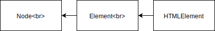
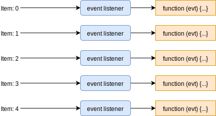
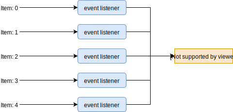
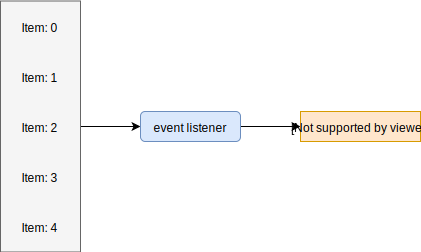

# Browser Events

## Monitor Events

The `monitorEvents(object[, events])` method instructs the DevTools to log 
information on the specified targets.

?> Mind that parameters inside `[]` are optional.

!> Warning: This function only works when you call it from the Chrome DevTools 
Console. It won't work if you try to call it in your scripts.

Listen to click events on the body of the page:

```javascript
monitorEvents(document.body, "click");
```

Stop listening to events on the `body` object:

```javascript
unmonitorEvents(document.body);
```

## Respond To Events

The `EventTarget` interface is inherited by all nodes and elements. This means 
that both the `document` object and any DOM element can be an event target.



The `EventTarget` interface has only three methods:

1. `EventTarget.addEventListener()`: sets up a function that will be called 
whenever the specified event is delivered to the target.
2. `EventTarget.removeEventListener()`: removes from the *EventTarget* an event 
listener previously registered with *EventTarget.addEventListener()*.
3. `EventTarget.dispatchEvent()`

## Adding An Event Listener

```javascript
<event-target>.addEventListener(<event-to-listen-for>, <function-to-run-when-an-event-happens>);
```

?>To see a full list of all of the possible events you can listen for, check out 
the Events documentation: [list of events](https://developer.mozilla.org/en-US/docs/Web/Events)

To add an event listener where the target is the `document`, and the type of 
event to listen for is a click event:

```javascript
document.addEventListener('click', function() {
  console.log('The page was clicked!');
});
```

Whenever we click on the page, the listener function (aka callback), outputs a 
message to the console.

## Removing An Event Listener

To remove an event listener, we use the `.removeEventListener()` method. 

However, before we look at it, we need to take a brief review of object 
equality.

Will the following equality test result in `true` or `false`?

```javascript
{ name: 'Richard' } === { name: 'Richard' }
```

Counterintuitively, these two objects are not equal. You need to think about, 
are they two separate objects (in this case yes) or are they different names 
referring to the same object?

**Example 1:**

Consider the following code:

```javascript
var a = {
    myFunction: function quiz() { console.log('hi'); }
};

var b = {
    myFunction: function quiz() { console.log('hi'); }
};
```

Does the following code evaluate to `true` or `false`?

```javascript
a.myFunction === b.myFunction
```

The answer is `false` since both of the `myFunction` functions are different 
functions. They look the same, but they are distinct entities.

**Example 2:**

Consider the following code:

```javascript
function quiz() { ... }

var a = {
    myFunction: quiz
};

var b = {
    myFunction: quiz
}
```

Does the following code evaluate to `true` or `false`?

```javascript
a.myFunction === b.myFunction
```

The answer is `true` since both of the `myFunction` functions are referring to 
the same, exact `quiz` function.

!> Ok, so why do we care about any of this object/function equality? The reason 
is that the `.removeEventListener()` method requires you to pass the same exact 
listener function to it as the one you passed to `.addEventListener()`.

```javascript
<event-target>.removeEventListener(<event-to-listen-for>, <function-to-remove>);
```

This code will successfully add and then remove an event listener:

```javascript
function myEventListeningFunction() {
  console.log('howdy');
}

// adds a listener for clicks, to run the `myEventListeningFunction` function
document.addEventListener('click', myEventListeningFunction);

// immediately removes the click listener that should run the `myEventListeningFunction` function
document.removeEventListener('click', myEventListeningFunction);
```

This code will fail to remove the event listener, because 
`.removeEventListener()` doesn't have the same exact listener function as the 
one we passed to `.addEventListener()`:

```javascript
myForm.addEventListener('submit', function respondToSubmit(){...});
myForm.removeEventListener('submit', function respondToSubmit(){...});
```

## Phases Of An Event

### Introduction

There are three different phases during the lifecycle of an event and the follow 
the order below:

1. the **capturing** phase
2. the **at target** phase
3. and the **bubbling** phase

For example, if we attach a *click* event to a *button* element. When the user 
clicks on the button, the whole event process starts. We first start off in the 
**capturing** phase. It starts at the *html* element and works its way down. 
Once it reaches the *button* element, it switches to the **at target** phase. 
Then, it switches to the **bubbling** phase and works its way all the way back 
up until it hits the document.

<hr>

There's actually a third optional argument to the  
`EventTarget.addEventListener()` method; the *useCapture* argument. This 
argument controls whether events will be dispatched to the listener during the 
**capturing** or **bubbling** phase. By default, when `.addEventListener()` is 
called with only two arguments, the method defaults to using the **bubbling** 
phase:

```javascript
target.addEventListener(type, listener[, useCapture]);
```

**Example:**

Consider the following code:

```html
<html>
  <body>
    <div class="container">
      <p>
        <button>Click me</button>
      </p>
    </div>
  </body>
</html>
```

```css
  html {background: white;}
  body {background: red; height: 100px;}
  p {background: green;}
  button {background: blue;}
```

JavaScript:

```javascript
// Bubble event listener
document.querySelector('body').addEventListener('click', function() {alert('body')});
// Capture event listener
document.querySelector('p').addEventListener('click', function() {alert('paragraph')}, true);
// Bubble event listener
document.querySelector('button').addEventListener('click', function() {alert('button')});
```

<iframe style="width:100%;height:150px;padding:0 1.4rem;margin:0;" src="_demos/javascript-and-the-dom/1.html"></iframe>

After running the code above, the order of the event listeners when the *button* 
element is clicked will be:

1. Paragraph event listener
2. Button event listener
3. Body event listener

When the *button* element is clicked, the process starts at the top and works 
its way down. When it gets to the body element it doesn't run the listener 
function (aka callback) because we're still in the **capturing** phase. However, 
when is reaches the paragraph, it will run the listener function and it does 
this because the event listener was set up to run in the capturing phase. Then 
it moves to the button, it switches from **capturing** to **at target** and 
fires the listener function. Then it switches to the **bubbling** phase and 
works its way back up. When it reaches the *body* it runs its listener function. 
Then it moves to the *html* element and finishes.

### The Event Object

When an event occurs, the browser includes an event object. This is just a 
regular JavaScript object that includes a ton of information about the event 
itself.

To store this event object we can simply add a parameter to the listener 
function:

```javascript
document.addEventListener('click', function (event) {  // The event parameter
   console.log(event); // Log out the event object
});
```

!> The name `event` does not provide any inherent meaning or special 
capabilities; there is nothing special to the name...it's just the name of the 
parameter. Feel free to give it any name that's informative/descriptive!

### The Default Action

Some examples of default actions are:

1. If you click on a link, it will automatically navigate you to the location 
listed in its `href` attribute: that's what it does by default.

2. When you submit a form, by default, it will send the data to the location in 
its `action` attribute.

However, the event object has a `.preventDefault()` method on it that a handler 
can call to prevent the default action from occurring!

**Example:**

Consider the following HTML fragment:

```html
<p>Default action: <a href="https://www.linuxfoundation.org" target="_blank" rel="noopener">Link</a></p>
<p>Prevent default action: <a class="prevent-default" href="https://www.linuxfoundation.org" target="_blank" rel="noopener">Link</a></p>
```

and JavaScript:

```javascript
document.querySelector('.prevent-default').addEventListener('click', function (e) {
  e.preventDefault();
  alert("Look, ma! We didn't navigate to a new page!");
});
```

<iframe style="width:100%;height:100px;padding:0 1.4rem;margin:0;" src="_demos/javascript-and-the-dom/2.html"></iframe>

## Avoid Too Many Events

Consider the following HTML:

```html
<html>
  <body>
  </body>
</html>
```

and JavaScript:

```javascript
const myList = document.createElement('ul');

for (let i = 0; i < 5; i++) {
  const newListElement = document.createElement('li');

  newListElement.textContent = 'Item: ' + i;

  newListElement.addEventListener('click', function (evt) {
    alert('A list item was clicked.');
  });

  myList.appendChild(newListElement);
}

document.body.appendChild(myList);
```

We're attaching an event listener with an anonymous handler to each item as we 
create it:

<iframe style="width:100%;height:150px;padding:0 1.4rem;margin:0;" src="_demos/javascript-and-the-dom/3.html"></iframe>



<hr>

A much more efficient way to do this, would be to extract the function and just 
reference the function instead of creating five different functions:

```javascript
const myList = document.createElement('ul');

function respondToTheClick() {
  alert('A list item was clicked.');
}

for (let i = 0; i < 5; i++) {
  const newListElement = document.createElement('li');

  newListElement.textContent = 'Item: ' + i;

  newListElement.addEventListener('click', respondToTheClick); // Reference to the callback

  myList.appendChild(newListElement);
}

document.body.appendChild(myList);
```



<hr>

However, we still have five event listeners of the same type. What if we moved 
all of the listeners to the `<ul>` instead?

```javascript
const myList = document.createElement('ul');

function respondToTheClick() {
  alert('A list item was clicked.');
}

for (let i = 0; i < 5; i++) {
  const newListElement = document.createElement('li');

  newListElement.textContent = 'Item: ' + i;

  myList.appendChild(newListElement);
}

myList.addEventListener('click', respondToTheClick);

document.body.appendChild(myList);
```



Now the browser doesn't have to store in memory five different event listeners 
and five different listener functions. That's a great for performance!

!> However, if you test the code above, you'll notice that we've lost access to 
the individual paragraphs. There's no way for us to target a specific paragraph 
element. So how do we combine this efficient code with the access to the 
individual paragraph items that we did before? We use a process called 
**event delegation**.