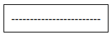
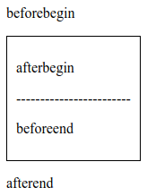
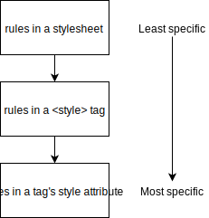

# Creating Content With JavaScript

## Update Existing Page Content

1. `Element.innerHTML`: gets/sets the HTML or XML markup contained within the 
element.
2. `Element.outerHTML`: gets the serialized HTML fragment describing the element 
including its descendants.
3. `Node.textContent`: sets/returns the text content of the specified node, and 
all its descendants.
4. `HTMLElement.innerText`: sets/returns the text content of the specified 
element, and all its descendants.


- `Element` refers to the `Element` interface.
- `Node` refers to the `Node` interface.
- `HTMLElement` refers to the `HTMLElement` interface.


### Inner HTML And Text Content

Consider the following HTML fragment:

```html
<h1 id="pick-me">Greetings To <span>All</span></h1>
```

```preview
Greetings To All
```

We can get the HTML content within the header as follows:

```javascript
var heading = document.querySelector('#pick-me');

console.log(heading.innerHTML); // Logs: 'Greetings To <span>All</span>'
```

We can get the HTML content describing the header as follows:

```javascript
var heading = document.querySelector('#pick-me');

console.log(heading.outerHTML); // Logs: '<h1 id="pick-me">Greetings To <span>All</span></h1>'
```

We can get the text content of the header as follows:

```javascript
var heading = document.querySelector('#pick-me');

console.log(heading.textContent); // Logs: 'Greetings To All'
```

We can set new text content for the heading as follows:

```javascript
var heading = document.querySelector('#pick-me');

heading.textContent = 'Hello World';
```

```preview
Hello World
```

We can set new text content for the heading once again as follows:

```javascript
var heading = document.querySelector('#pick-me');

heading.textContent = 'Hello <strong>World</strong>';
```

```preview
Hello <strong>World</strong>
```

!> Passing any text that looks like HTML to `.textContent`, will still be 
displayed as text. It will not be displayed as HTML when the element is 
rendered.

If we'd like to update an element, including its HTML, then we need to use the
`.innerHTML` property:

```javascript
var heading = document.querySelector('#pick-me');

heading.innerHTML = 'Hello <strong>World</strong>';
```

```preview
Hello World
```

### Text Content v2

Consider the following HTML fragment:

```html
<h1>Hello <span>World</span></h1>
```

... and CSS:

```css
h1 { text-transform: uppercase; }
span { display:none; }
```

Preview:
```preview
HELLO
```

The two properties return different results:

```javascript
const heading = document.querySelector('h1');

console.log(heading.textContent); // Logs: 'Hello World'

console.log(heading.innnerText); // Logs: 'HELLO'
```

!> While both `.textContent` and `.innerText` set/return an element's text 
content, there is an important distinction between them. The `.textContent` 
property returns all of the text regardless of CSS and the `.innerText` property 
returns the text as it would be seen visually.

## Add New Page Content

1. `Document.createElement()`: creates the HTML element specified by *tagName*.
2. `Document.createTextNode()`: creates a new Text node.
3. `Node.appendChild()`: adds a node to the end of the list of children of a 
specified parent node. If the given child is a reference to an existing node in 
the document, *appendChild()* moves it from its current position to the new 
position.
4. `Element.insertAdjacentHTML()`: parses the specified text as HTML or XML and 
inserts the resulting nodes into the DOM tree at a specified position.


- `Document` refers to the `Document` interface.
- `Node` refers to the `Node` interface.
- `Element` refers to the `Element` interface.

### Adding Content To The Page

Consider the following HTML fragment:

```html
<h1>Learn JavaScript</h1>
```

```preview
Learn JavaScript
```

We can add an element to the end of header as follows:

```javascript
// Create a <span> element
const newSpanElement = document.createElement('span');

// Set text content
newSpanElement.textContent = ', right now!';

// Select heading
const heading = document.querySelector('h1');

// Add <span> to the end of <h1>
heading.appendChild(newSpanElement);
```

```preview
Learn JavaScript, right now!
```

### Creating Text Nodes

Consider an empty document:

```preview
```

We can create a paragraph, and add it to the document as follows:

```javascript
// METHOD #1

// Create a paragraph and set its content
const paragraph = document.createElement('p');
const text  = document.createTextNode('Hello World!');
paragraph.appendChild(text);

// Add paragraph to the document
document.querySelector('body').appendChild(paragraph);

// METHOD #2

// Create a paragraph and set its content
const paragraph = document.createElement('p');
paragraph.textContent = 'Hello World!';

// Add paragraph to the document
document.querySelector('body').appendChild(paragraph);
```

```preview
Hello World!
```

### Moving Elements

!> The `appendChild()` method not only will add an element to the end of the 
specified parent element. It can also move a rendered element from its current 
position to a new one.

Consider the following HTML fragment:

```html
<h1>Primary:</h1>
<h2>Secondary:</h2>
```

What happens after running this code?

```javascript
// Select primary heading
const primaryHeading = document.querySelector('h1');

// Select secondary heading
const secondaryHeading = document.querySelector('h2');

// Create a <span> element and set its content
const spanElement = document.createElement('span');
spanElement.textContent = '!!!';

// Add <span> element to the end of primary heading
primaryHeading.appendChild(spanElement);

// Move <span> element from the primary heading to the end of secondary heading
secondaryHeading.appendChild(spanElement);
```

```preview
Primary:
Secondary:!!!
```

As we can see, only the secondary heading has three exclamation marks. The 
`.appendChild()` method will move an element from its current position to the 
new position.

### Inserting HTML In Other Locations

The `.insertAdjacentHTML()` method has to be called with two arguments:

- the location of the HTML
- the HTML markup that is going to be inserted

Consider the following HTML fragment:

```html
<div>
------------------------
</div>
```



```javascript
const container = document.querySelector('div');
const htmlText1 = '<p>beforebegin</p>';
const htmlText2 = '<p>afterbegin</p>';
const htmlText3 = '<p>beforeend</p>';
const htmlText4 = '<p>afterend</p>';

container.insertAdjacentHTML('beforebegin', htmlText1);
container.insertAdjacentHTML('afterbegin', htmlText2);
container.insertAdjacentHTML('beforeend', htmlText3);
container.insertAdjacentHTML('afterend', htmlText4);
```



## Remove Page Content

1. `Node.removeChild()`: removes a child node from the DOM and returns the 
removed node.
2. `ChildNode.remove()`: removes the object from the tree it belongs to.
3. `ParentNode.firstElementChild`: returns the object's first child Element, or 
*null* if there are no child elements.
4. `Node.parentElement`: returns the DOM node's parent Element, or *null* if the 
node either has no parent, or its parent isn't a DOM Element.


- `Node` refers to the `Node` interface.
- `ChildNode` refers to the `ChildNode` interface.
- `ParentNode` refers to the `ParentNode` interface.

### Removing A Child Element {docsify-ignore}

Consider the following HTML fragment:

```html
<div id="parent">
  <div>Hello World</div>
</div>
```

```preview
Hello World
```

To remove a specified element when knowing its parent node:

```javascript
const parent = document.querySelector('#parent');
const child = parent.firstElementChild;
const removedNode = parent.removeChild(child);
```

```preview
```

There is a drawback with the `removeChild()` method. It requires access to 
the parent to function. Fortunately there is an easy workaround:

Consider the following HTML fragment:

```html
<div>
  <div id="child">Hello World</div>
</div>
```

```preview
Hello World
```

To remove a specified element when we don't know directly its parent node:

```javascript
const child = document.querySelector('#child');
const removedNode = child.parentElement.removeChild(child);
```

```preview
```

There is an even easier way to do all of this. We can remove the child 
element directly with `.remove()` method:

```javascript
const child = document.querySelector('#child');
child.remove();
```

```preview
```

## Style Page Content

1. `HTMLElement.style.<property>`:  gets/sets the inline style of an element.
2. `CSSStyleDeclaration.cssText`: returns/sets the text of the element's inline 
style declaration only.
3. `Element.setAttribute()`: sets the value of an attribute on the specified 
element. If the attribute already exists, the value is updated; otherwise a new 
attribute is added with the specified name and value.
4. `Element.className`: gets/sets the value of the *class* attribute of the 
specified element.
5. `Element.classList`: returns a live DOMTokenList collection of the class 
attributes of the element.

!>Out of the list of styling techniques we'll learn in this section, 
`.classList` is by far the most helpful property of the bunch, and it helps to 
keep your CSS styling out of your JavaScript code.

### CSS Specificity



### Modifying The Style Attribute

**Example:**

Consider the following HTML fragment:

```html
<h1>Hello World!</h1>
```


a) To style an element with the most specific (inline) rule:

```javascript
const heading = document.querySelector('h1');
heading.style.fontSize = '20px';
```


b) We can use the `CSSStyleDeclaration.cssText` property to set multiple inline CSS 
styles at once:

```javascript
heading.style.cssText = 'font-size: 20px; text-decoration: underline; color: blue;';
```


!> Notice that unlike `HTMLElement.style.<property>` using `CSSStyleDeclaration.cssText`, we write the CSS styles just as we sould in a stylesheet; so we write `font-size` instead of `fontSize`.

c) Another way to set styles is to use the `.setAttribute()` method:

```javascript
heading.setAttribute('style', 'text-transform:uppercase;background:gray;');
```


The `.setAttribute()` method is not just for styling. We can use this method 
to set any attribute for an element.

### Accessing An Element's Classes

**Example 1:**

Consider the following HTML fragment:

```html
<p id="message" class="d-inline-block bg-warning">[Deprication] item is deprecated and will be removed</p>
```

and CSS:

```css
.bg-warning {
  background-color: #ffc107;
}
.d-inline-block {
  display: inline-block;
}
.text-underline {
  text-decoration: underline;
}
```


We can get the value of the *class* attribute of the specified element as 
follows:

```javascript
// Select element
const message = document.querySelector('#message');
// Get the value of the class attribute
const classAttributeValue = message.className;
// Return value is a string
console.log(typeof(classAttributeValue)); // Logs: "string"
// Output value
console.log(classAttributeValue); // Logs: "d-inline-block bg-warning"
```

This method returns a string which sometimes may not be the ideal format. To 
convert the string into an array we can use the `String.prototype.split()` 
method:

```javascript
// Split the string into an array of substrings (separator = ' ')
const arrayOfClasses = classAttributeValue.split(' ');

// Print array elements
arrayOfClasses.forEach(function(elem) {
  console.log(elem);
});

// Expected output: "d-inline-block"
// Expected output: "bg-warning"
```

We can set the value of the *class* attribute of the element, overwriting any 
classes that were originally in the element's *class* attribute like so:

```javascript
// Set the value of the class attribute
message.className = "text-underline";
```


!> The above code erases any classes that were originally in the element's 
*class* attribute and replaces it with the single class *text-underline*.

**Example 2:**

Since `.className` returns a string, it makes it hard to add or remove 
individual classes. One solution that I showed earlier, is to convert the string 
to an array. However, we don't want to do all of that work. Let's use the newer 
`.classList` property.

Consider the following HTML fragment:

```html
<p id="message" class="d-inline-block bg-warning">[Deprication] item is deprecated and will be removed</p>
```

and CSS:

```css
.bg-warning {
  background-color: #ffc107;
}
.d-inline-block {
  display: inline-block;
}
.text-underline {
  text-decoration: underline;
}
```


We can easily add classes to the element without overwriting classes that were 
originally in the element's `class` attribute:

```javascript
// Select element
const message = document.querySelector('#message');

// Add a class to the collection
message.classList.add('text-underline');
```


We can easily remove classes from the element without overwriting classes that 
were originally in the element's `class` attribute:

```javascript
// Remove a class from the collection
message.classList.remove('d-inline-block');
```


We can easily toggle (add the class if it doesn't exists or remove it if it does 
already exist) classes from the element without overwriting classes that 
were originally in the element's `class` attribute:

```javascript
// Remove a class from the collection
message.classList.toggle('text-underline');
```


We can easily check if a class exists in the list or not:

```javascript
console.log(message.classList.contains('text-underline')); // Logs: false
console.log(message.classList.contains('bg-warning')); // Logs: true
```

### Important

!>Separation of concerns means HTML should be in the HTML file, styling should 
be in a CSS file, and interactivity should be in a JavaScript file. It's best 
not to mix these together. It's wrong to write and add styles directly with 
JavaScript. Instead let JavaScript control the class attribute for an element.

!>Out of the list of styling techniques we learned in this section, 
`.classList` is by far the most helpful property of the bunch, and it helps to 
keep your CSS styling out of your JavaScript code.