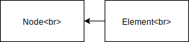

# The Document Object Model

1. "The DOM" is the full, parsed representation of HTML markup. It's a tree 
structure that defines the relations between nodes and captures their content 
and properties. The DOM is *not* part of the JavaScript language, and it is 
globally accessible using the `document` object which is provided by the 
browser.

2. The `document` object is an object just like a JavaScript object. This means 
it has key/value pairs. Some of the values are pieces of data, while others are 
functions (aka methods).

## Selecting Page Elements

1. `document.getElementById()`: This *Document* method returns an *Element* 
object representing the element whose *id* property matches the specified 
string.
2. `document.getElementsByClassName()`: This *Document* method returns an 
array-like object of all child elements which have all of the given class names.
3. `document.getElementsByTagName()`: This *Document* method returns a live 
HTMLCollection of elements with the given tag name.

?> - Passing `document.getElementById()` an unknown *id*, returns `null`<br>- 
The list that's returned from methods 1 and 2 is not an array.<br>- 
`.getElementsByClassName()` and `.getElementsByTagName()` both have an extra 
"s" in their name. Unlike `.getElementById()`, they could return multiple items.

Examples:

```javascript
// Select the element with the ID of "logo"
document.getElementById('logo');

// Select all elements that have the class "accent-color"
document.getElementsByClassName('accent-color');

// Select all "span" elements
document.getElementsByTagName('span');
```

## Nodes, Elements, And Interfaces



`Node` is the blueprint/interface with properties and methods for creating 
*nodes*.

`node` is the real object built from the *Node* interface.

`Element` is the blueprint/interface with properties and methods for creating 
*elements*. It inherits all of the *Node* interface's properties and methods.

`element` is the real object built from the *Element* interface.

?> Since the `Element` interface is a descendant of the `Node` interface, every 
`element` that was created from the `Element` interface is also a `node`.

Both the `Document` and `Element` interfaces have a method called 
`.getElementsByClassName()`. This means we can do something like the following:

```javascript
//Select the DOM element with an ID of "sidebar"
const sidebarElement = document.getElementById('sidebar');

// Search within the "sidebar" element
const subHeading = sidebarElement.getElementsByClassName('sub-heading');
```

## New Selectors

Standardized methods (widely supported):

1. `document.getElementById()`: This *Document* method returns an *Element* 
object representing the element whose *id* property matches the specified 
string.
2. `document.getElementsByClassName()`: This *Document* method returns an 
array-like object of all child elements which have all of the given class names.
3. `document.getElementsByTagName()`: This *Document* method returns a live 
HTMLCollection of elements with the given tag name.

New methods:

1. `document.querySelector()`: This *Document* method returns the first 
*Element* within the document that matches the specified selector, or group of 
selectors. If no matches are found, *null* is returned.

This method allows us to select **single** elements just like we do with CSS:

```javascript
// Find and return the element with an ID of "header"
document.querySelector('#header');

// Find and return the first element with the class "header"
document.querySelector('.header');

// Find and return the first <header> element
document.querySelector('header');
```

2. `document.querySelectorAll()`: This *Document* method returns a static 
(not live) *NodeList* representing a list of the document's elements that match 
the specified group of selectors.

This method allows us to select **multiple** elements just like we do with CSS:

```javascript
// Find and return a list of elements with the class "header"
document.querySelectorAll('.header');

// Find and return a list of <header> elements
const allHeaders = document.querySelectorAll('header');
```

We can loop over a `NodeList` with either `forEach()` or the classic `for` loop:

```javascript
for (let i = 0; i < allHeaders.length; i++) {
  console.log(allHeaders[i]);
}

// or

allHeaders.forEach(function(header) {
  console.log(header);
});
```
