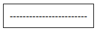
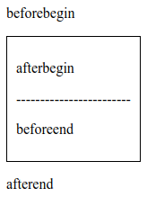

# Creating Content With JavaScript

## Update Existing Page Content

1. `element.innerHTML`: get or set the HTML or XML markup contained within the 
element.
2. `element.outerHTML`: get the serialized HTML fragment describing the element 
including its descendants.
3. `node.textContent`: set or return the text content of the specified node, and 
all its descendants.
4. `HTMLelement.innerText`: set or return the text content of the specified 
element, and all its descendants.


- `element` is an object of the `Element` interface.
- `node` is an object of the `Node` interface.
- `HTMLelement` is an object of the `HTMLElement` interface.


### Inner HTML And Text Content

Consider the following HTML fragment:

```html
<h1 id="pick-me">Greetings To <span>All</span></h1>
```

```preview
Greetings To All
```

We can get the HTML content within the header as follows:

```javascript
var heading = document.querySelector('#pick-me');

console.log(heading.innerHTML); // Logs: 'Greetings To <span>All</span>'
```

We can get the HTML content describing the header as follows:

```javascript
var heading = document.querySelector('#pick-me');

console.log(heading.outerHTML); // Logs: '<h1 id="pick-me">Greetings To <span>All</span></h1>'
```

We can get the text content of the header as follows:

```javascript
var heading = document.querySelector('#pick-me');

console.log(heading.textContent); // Logs: 'Greetings To All'
```

We can set new text content for the heading as follows:

```javascript
var heading = document.querySelector('#pick-me');

heading.textContent = 'Hello World';
```

```preview
Hello World
```

We can set new text content for the heading once again as follows:

```javascript
var heading = document.querySelector('#pick-me');

heading.textContent = 'Hello <strong>World</strong>';
```

```preview
Hello <strong>World</strong>
```

!> Passing any text that looks like HTML to `.textContent`, will still be 
displayed as text. It will not be displayed as HTML when the element is 
rendered.

If we'd like to update an element, including its HTML, then we need to use the
`.innerHTML` property:

```javascript
var heading = document.querySelector('#pick-me');

heading.innerHTML = 'Hello <strong>World</strong>';
```

```preview
Hello World
```

### Text Content v2

Consider the following HTML fragment:

```html
<h1>Hello <span>World</span></h1>
```

... and CSS:

```css
h1 { text-transform: uppercase; }
span { display:none; }
```

Preview:
```preview
HELLO
```

The two properties return different results:

```javascript
const heading = document.querySelector('h1');

console.log(heading.textContent); // Logs: 'Hello World'

console.log(heading.innnerText); // Logs: 'HELLO'
```

!> While both `.textContent` and `.innerText` set/return an element's text 
content, there is an important distinction between them. The `.textContent` 
property returns all of the text regardless of CSS and the `.innerText` property 
returns the text as it would be seen visually.

## Add New Page Content

1. `document.createElement()`: create the HTML element specified by tagName.
2. `document.createTextNode()`: create a new Text node.
3. `node.appendChild()`: add a node to the end of the list of children of a 
specified parent node. If the given child is a reference to an existing node in 
the document, appendChild() moves it from its current position to the new 
position.
4. `element.insertAdjacentHTML()`: parses the specified text as HTML or XML and 
inserts the resulting nodes into the DOM tree at a specified position.


- `document` is an object of the `Document` interface.
- `node` is an object of the `Node` interface.
- `element` is an object of the 'Element' interface.

### Adding Content To The Page

Consider the following HTML fragment:

```html
<h1>Learn JavaScript</h1>
```

```preview
Learn JavaScript
```

We can add an element to the end of header as follows:

```javascript
// Create a <span> element
const newSpanElement = document.createElement('span');

// Set text content
newSpanElement.textContent = ', right now!';

// Select heading
const heading = document.querySelector('h1');

// Add <span> to the end of <h1>
heading.appendChild(newSpanElement);
```

```preview
Learn JavaScript, right now!
```

### Creating Text Nodes

Consider an empty document:

```preview
```

We can create a paragraph, and add it to the document as follows:

```javascript
// METHOD #1

// Create a paragraph and set its content
const paragraph = document.createElement('p');
const text  = document.createTextNode('Hello World!');
paragraph.appendChild(text);

// Add paragraph to the document
document.querySelector('body').appendChild(paragraph);

// METHOD #2

// Create a paragraph and set its content
const paragraph = document.createElement('p');
paragraph.textContent = 'Hello World!';

// Add paragraph to the document
document.querySelector('body').appendChild(paragraph);
```

```preview
Hello World!
```

### Moving Elements

!> The `appendChild()` method not only will add an element to the end of the 
specified parent element. It can also move a rendered element from its current 
position to a new one.

Consider the following HTML fragment:

```html
<h1>Primary:</h1>
<h2>Secondary:</h2>
```

What happens after running this code?

```javascript
// Select primary heading
const primaryHeading = document.querySelector('h1');

// Select secondary heading
const secondaryHeading = document.querySelector('h2');

// Create a <span> element and set its content
const spanElement = document.createElement('span');
spanElement.textContent = '!!!';

// Add <span> element to the end of primary heading
primaryHeading.appendChild(spanElement);

// Move <span> element from the primary heading to the end of secondary heading
secondaryHeading.appendChild(spanElement);
```

```preview
Primary:
Secondary:!!!
```

As we can see, only the secondary heading has three exclamation marks. The 
`.appendChild()` method will move an element from its current position to the 
new position.

### Inserting HTML In Other Locations

The `.insertAdjacentHTML()` method has to be called with two arguments:

- the location of the HTML
- the HTML markup that is going to be inserted

Consider the following HTML fragment:

```html
<div>
------------------------
</div>
```



```javascript
const container = document.querySelector('div');
const htmlText1 = '<p>beforebegin</p>';
const htmlText2 = '<p>afterbegin</p>';
const htmlText3 = '<p>beforeend</p>';
const htmlText4 = '<p>afterend</p>';

container.insertAdjacentHTML('beforebegin', htmlText1);
container.insertAdjacentHTML('afterbegin', htmlText2);
container.insertAdjacentHTML('beforeend', htmlText3);
container.insertAdjacentHTML('afterend', htmlText4);
```



